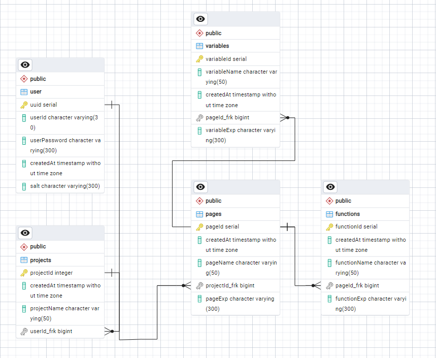

Project Overview
Techonologies Used
Lambda Function Layers
ERD

REST APIs

Layer

> Open ai, axios, pg
> RDS + Lambda + API gateway

page

-   create (name, projectId, exp) / all in body
-   update (pageId, page name, pageExp) / id - querystring, name exp in body

variable

-   create (name, exp ,page id) -> all in body
-   update (id, exp, name) -> id - query string, name exp in body
    function

-   create (name, exp, id) -> all in body
-   update (id, exp, name) -> id - query string, name exp in body
